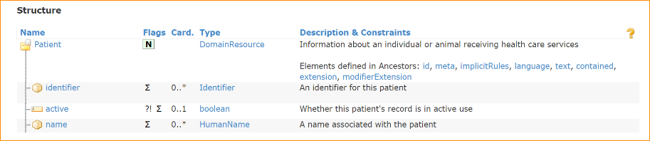

# Module 0 - Introduction to JSON
- JSON
    - What is JSON?
        - Json stands for JavaScript Object Notation/ Json significa Notação de Objetos JavaScript
        - JSON is a lightweight data interchange format/Json é um formato leve de intercâmbio de dados
        - JSON ´s plain text written in JavaScript object annotation/Json é um texto simples escrito em anotação de objetos JavaScript
        - JSON é used to send data between computers/Json é usado para enviar dados entre computadores
        - JSON is language independent/Json é independente de linguagem
      > A sintaxe do JSON é derivada da notação de objetos do JavaScript, mas o formato JSON é apenas texto. Existem códigos para ler e gerar JSON em muitas linguagens de programação. Como o formato é apenas texto, os dados JSON podem ser facilmente enviados entre computadores e usados por qualquer linguagem de programação.

Os dados JSON podem ser armazenados como texto no backend.
- JSON Syntax Rules
    - Data is in name/value pairs/Os dados estão em pares nome/valor
    - Data is separated by commas/Os dados são separados por vírgulas
    - Curly braces hold objects/Chaves curvas contêm objetos
    - Square brackets hold arrays/Colchetes quadrados contêm arrays
- JSON name/value pairs
    - JSON data is written as name/value pairs (aka key value pairs)/Os dados JSON são escritos como pares nome/valor (também conhecidos como pares chave/valor)
    - A name/value pair consists of a field name(id double quotes), followed by a colon, followed by a value:  / Um par nome/valor consiste em um nome de campo (entre aspas duplas), seguido por dois pontos, seguido por um valor:
        - example: "name": "John"
        - JSON names require double quotes/Os nomes JSON exigem aspas duplas
        - Here "name" is called JSON property or the element and "John" is the value/Aqui "name" é chamado de propriedade JSON ou elemento e "John" é o valor
        - It is not mandatory to have space before or after colon (:) separating the element with its value. Both formats shown above are correct.
        - Não é obrigatório ter espaço antes ou depois dos dois pontos (:) que separam o elemento de seu valor. Ambos os formatos mostrados acima estão corretos.
- JSON Data Types
    - Valid Data Types
        - In JSON, values must be one fo the following data types/ Em JSON, os valores devem ser um dos seguintes tipos de dados:
            - String (text between double quotes)/String (texto entre aspas duplas)
            - Number (integer or floating point)/Número (inteiro ou ponto flutuante)
            - Object (JSON object enclosed in curly braces)/Objeto (objeto JSON entre chaves curvas)
            - Array (JSON array enclosed in square brackets)/Array (array JSON entre colchetes quadrados)
            - Boolean (true or false)/Booleano (verdadeiro ou falso)
            - Null
    - JSON values cannot be one of the following data type:
        - a function/uma função
        - undefined/indefinido
        - a date(date is written as string in JSON elements)
    - JSON Strings
        - Strings in JSON must be written in double quotes/Strings em JSON devem ser escritas entre aspas duplas
        - Strings can contain any Unicode character/Strings podem conter qualquer caractere Unicode
        - Strings can be empty/Strings podem estar vazias
        - Example: "name": "John"
    - JSON Numbers
        - Numbers in JSON must be an integer or floating point/Números em JSON devem ser um inteiro ou ponto flutuante
        - Example: "age": 30
        - Number value shall not be in double quotes/Valor numérico não deve estar entre aspas duplas
        - A floating point number, is a positive or negative whole number with a decimal point. For example, 5.5, 0.25, and -103.342 are all floating point numbers, while 91, and 0 are not
        - Um número de ponto flutuante é um número inteiro positivo ou negativo com um ponto decimal. Por exemplo, 5,5, 0,25 e -103,342 são todos números de ponto flutuante, enquanto 91 e 0 não são
    - JSON Booleans
        - Values in JSON can be true/false /Valores em JSON podem ser verdadeiro/falso
        - Example: "patientDeceased": false
        - No double quotes for Boolean property values / Sem aspas duplas para valores de propriedades booleanas
    - JSON Primitive elements
        - Element with a single value
        - Example:
        - ```json
        "name": "John"
        "age": 30
      ```
      - Elements which do not have further elements inside it and therefore no {} braces / Elementos que não possuem outros elementos dentro dele e, portanto, não possuem chaves {}.
      - Primitive elements are always name and value pairs / Elementos primitivos são sempre pares de nome e valor
      - We can have primitive repeating elements(one element with multiple values as explained in below slide) / Nós podemos ter elementos primitivos repetidos (um elemento com vários valores)
      - ```json
        "name": "John",
        "age": 30,
        "
      ```
    - JSON Objects
        - Element inside element / Elemento dentro de elemento
        - It is also called complex elements where one JSON element contains other elemnts using {} braces / Também é chamado de elementos complexos, onde um elemento JSON contém outros elementos usando chaves {}
        - Example - in below example, "employee" is the parent element or the object containing other elements inside it. { to be used to start the object and close it with} / Exemplo - no exemplo abaixo, "employee" é o elemento pai ou o objeto que contém outros elementos dentro dele. { para ser usado para iniciar o objeto e fechá-lo com }
        - Object insede object is possible / Objeto dentro de objeto é possível
        - Example:
          ```json
          "employee": {
            "name": "John",
            "age": 30,
            "address": {
              "street": "123 Main St",
              "city": "New York"
            }
          }
          ```
    - JSON Arrays
        - Array simply meaning repeating values / Array simplesmente significa valores repetidos
        - An element can have repeating or multiple values / Um elemento pode ter valores repetidos ou múltiplos
        - Each value shall be separated by a comma /
        - Example:
          ```json
          "name": ["Aditya", "Alok", "Aman"]
          ```
          > "name" is array which means it can have repeating values. there are 3 values for this element each separated by , / "nome" é um array que significa que pode ter valores repetidos. há 3 valores para este elemento, cada um separado por ,
          > Array is represented using [] in JSON / Array é representado usando [] em JSON
        - Please note that value can ben string, integer etc. based on the data type chosen / Por favor, observe que o valor pode ser string, inteiro etc. com base no tipo de dado escolhido
        - In JSON, array values must be of type string, number, object, array, Boolean ou null. / Em JSON, os valores do array devem ser do tipo string, number, object, array, Boolean ou null.
        - If an element by definition can repeat, it shall have [] ou array even if you are not having multiple values for the element / Se um elemento por definição puder ser repetido, ele deverá ter [] ou array, mesmo que você não tenha vários valores para o elemento
    - Objects and Arrays
        - Objects can have repeating elements / Objetos podem ter elementos repetidos
        - Example:
        - ```json
        "employees": [
          {
            "name": ["John", "Kumar"],
            "age": 30
          },
          {
            "name": "Jane",
            "age": 25
          }
        ]
      ```
      - name element is primitive and repeating. "employees" element is complex with two elements inside it. / o elemento nome é primitivo e repetido. o elemento "funcionários" é complexo com dois elementos dentro dele.
    - Complex and repeating element
        - An element can both be complex and repeating also
        - Example: name element is repeating therefore using [] and also complex using {} braces/ Exemplo: o elemento nome está repetindo, portanto, usando [] e também complexo usando chaves {}
        - The whole name element is Repeating. In below example, it has only one repetition. Please note that repeating element not necessarily repeats. / O elemento inteiro nome está repetindo. No exemplo abaixo, ele tem apenas uma repetição. Observe que o elemento repetido não necessariamente se repete.
        - Example:
          ```json
          "employees": [
            {
              "name": {
                "first": ["John","Kumar"],
                "last": "Doe"
              },
              "age": 30
            }
          ]
          ```
    - An element can both be complex and repeating also / Um elemento pode ser complexo e repetido também
        - Example: name element is repeating with multiple repetions
            - Example:
                ```json
                "employees": [
                {
                    "name": {
                    "first": ["John","Kumar"],
                    "last": "Doe"
                    },
                    "age": 30
                },
                {
                    "name": {
                    "first": ["Jane"],
                    "last": "Doe"
                    },
                    "age": 25
                }
                ]
                ```
                - See the comma after first repetion of the name element, highlighted in red. / Veja a vírgula após a primeira repetição do elemento nome, destacada em vermelho.
                - Comma to be used whenever one element is over and you want to segregate it with another element / Vírgula a ser usada sempre que um elemento terminar e você quiser segregá-lo com outro elemento
        - How to decide when to use [] or {}
        - Element cardinality anbd data type decides id element if element is primitive/complex AND non-repeating/repeating / A cardinalidade do elemento e o tipo de dado decidem se o elemento é primitivo/complexo E não repetido/repetido
        - Cardinality and data type is defines element in the respective standards or definitions / A cardinalidade e o tipo de dado definem o elemento nos respectivos padrões ou definições
        - In below structure, card means cardinality and 0...* means element is optional and can repeat where as 0...1 means element is optional and cannot repeat. "Type" column is for data type / Na estrutura abaixo, card significa cardinalidade e 0...* significa que o elemento é opcional e pode se repetir, enquanto 0...1 significa que o elemento é opcional e não pode se repetir. A coluna "Tipo" é para o tipo de dado
        - Example: 

- XML
  - What is XML?
    - XML stands for eXtensible Markup Language / XML significa Linguagem de Marcação Extensível
    - XML was designed to store and transport data/ XML foi projetado para armazenar e transportar dados
    - XML was designed to be both human-and machine-readable/XML foi projetado para ser legível tanto por humanos quanto por máquinas
    - HTML was designed to display data - with focos on how data looks/HTML foi projetado para exibir dados - com foco em como os dados são exibidos
    - XML tags are not predefined like html tags are / As tags XML não são pré-definidas como as tags HTML
  - No predefined tags in XML
    - Example: 
      ```xml
      <note>
        <to>Tove</to>
        <in>Jani</in>
        <firstName>Reminder</firstName>
        <body>Don't forget me this weekend!</body>
      </note>
      ```
    - The tags in the example above (like <in> and <firstName>) are not defined in any XML standard/ As tags no exemplo acima (como <in> e <firstName>) não estão definidas em nenhum padrão XML
    - HTML works with predefined tags like <h1>, <p>, <div> etc. / HTML funciona com tags pré-definidas como <h1>, <p>, <div> etc.
    - With XML, the author must define both the tags and the document structure / Com XML, o autor deve definir tanto as tags quanto a estrutura do documento
    - In above example, <in> tag means last name, this information has to defined by the author explicity in the XML definition / No exemplo acima, a tag <in> significa sobrenome, essa informação deve ser definida pelo autor explicitamente na definição XML
  - XML simplifies things
    - XML simplifies data sharing/ XML simplifica o compartilhamento de dados
    - XML simplifies data transport/ XML simplifica o transporte de dados
    - XML simplifies plataform changes/ XML simplifica mudanças de plataforma
    - XML simplifies data availability/ XML simplifica a disponibilidade de dados
    - Many computer system contain data in incompatible formats/ Muitos sistemas de computador contêm dados em formatos incompatíveis
    - Exchanging data between incompatible systems(or upgraded systems) is a time-consuming task for web developers. / Trocar dados entre sistemas incompatíveis (ou sistemas atualizados) é uma tarefa demorada para os desenvolvedores web.
    - Large amounts of data must be converted and incompatible data is often lost / Grandes quantidades de dados devem ser convertidas e dados incompatíveis são frequentemente perdidos
    - With XML, data can be availiable to all kinds of "reading machines" like people, computers, voice machine, news feeds, etc
    - Com XML, os dados podem estar disponíveis para todos os tipos de "máquinas de leitura", como pessoas, computadores, máquinas de voz, feeds de notícias etc
  - XML syntax
    - XML documents must contain one root element that is the parent of all other elements / Documentos XML devem conter um elemento raiz que é o pai de todos os outros elementos
    - EXample: 
      ```xml
      <Patient>
        <name>Tove</name>
        <from>Jani</from>
        <heading>Reminder</heading>
        <body>Don't forget me this weekend!</body>
      </Patient>
      ```
  - XML Prolog
    - This line is called the xml prolog: / Esta linha é chamada de prólogo XML:
      ```xml
      <?xml version="1.0" encoding="UTF-8"?>
      ```
  - The XML prolog is optional. If it exists, it must come first in the document / O XML prolog é opcional. Se existir, deve vir primeiro no documento
  - XML document can contain international characters, like Norwegian or French characters / O documento XML pode conter caracteres internacionais, como caracteres noruegueses ou franceses
  - To avoid erros, you should specify the encoding used, or save your XML files as UTF-8 / Para evitar erros, você deve especificar a codificação usada ou salvar seus arquivos XML como UTF-8
  - UTF-8 is the default character encoding for XML documents / UTF-8 é a codificação de caracteres padrão para documentos XML
  
  - XML Element
    - An XML element is everything from (including) the element's start tag to (including) the element's end tag / um elemento XML é tudo desde (incluindo) a tag de início do elemento até (incluindo) a tag de fim do elemento
    - An element can contain
      - text / Texto
      - attributes
      - other elements
      - or a mix of the above / ou uma mistura dos acima
    - ```xml
      <Patient>                         <!-- Patient, name, family and given are XML / Patient, name, family e given são XML -->
        <name> 
          <lastName value="Jani"></lastName>    <!-- lastName consists of a value attribute / lastName consiste em um atributo de valor -->
          <firstName>Tove</firstName>           <!-- firstName element is also called a text node or text element / o elemento firstName também é chamado de nó de texto ou elemento de texto -->
        </name>
      </Patient>                                <!-- Patient element is the root element in this XML fragment / o elemento Patient é o elemento raiz neste fragmento XML -->
      ```
    - XML Element opening and closing tags
      - An XML element starts with an opening tag and ends with a closing tag / Um elemento XML começa com uma tag de abertura e termina com uma tag de fechamento
      - Name of the element must be exactly same in both the tags / O nome do elemento deve ser exatamente o mesmo em ambas as tags
      - XML element names are case sensitive, therefore opening and closing tags must have same element name aling with case sensitiveness 
      - Os nomes dos elementos XML diferenciam maiúsculas de minúsculas, portanto, as tags de abertura e fechamento devem ter o mesmo nome de elemento junto com a diferenciação de maiúsculas e minúsculas
    - XML Empty Element
      - An element with no content is said to be empty / Um elemento sem conteúdo é dito estar vazio
      - In XML, you can indicate an empty element like this: / Em XML, você pode indicar um elemento vazio assim:
        ```xml
        <lastName value="" /> 
        <lastName></lastName> 
        <lastName />
        ```
    - XML Naming Rules
      - XML elements must foloow these naming rules: / Os elementos XML devem seguir estas regras de nomenclatura:
        - Element names are case-sensitive / Os nomes dos elementos diferenciammaiúsculas de minúsculas
        - Element names must start with a letter ou undescore (_) / Os nomes dos elementos devem começar com uma letra ou sublinhado (_)
        - Element names cannot start with the letters xml (or XML, or Xml, etx)./ Os nomes dos elementos não podem começar com as letras xml (ou XML, ou Xml, etc).
        - Element names can contain letters, digits, hyphens, undescores, and periods / Os nomes dos elementos podem conter letras, dígitos, hífens, sublinhados e pontos
        - Element names cannot contain spaces / Os nomes dos elementos não podem conter espaços
        - Any name can be used, no words are reserved (except xml) / Qualquer nome pode ser usado, nenhuma palavra é reservada (exceto xml)
  - XML Attribute
    - Attributes values must always be quoted. Either single ou double quotes can be used. / Os valores dos atributos devem sempre ser entre aspas. Podem ser usadas aspas simples ou duplas.
    - We can also write the above information like this(text node) / Podemos também escrever as informações acima assim (nó de texto):
      ```xml
      <lastName value="Jani" />
      ```
    - Both example provide the same information. There are no rules about when to use attributes or when to use elements in XML
    - Ambos os exemplos fornecem as mesmas informações. Não há regras sobre quando usar atributos ou quando usar elementos em XML
  - XML Namespace - conflit
    - In XML, element names are defined by the developer. This often results in a conflict when trying to mix XML documents from different XML applications
    - Em XML, os nomes dos elementos são definidos pelo desenvolvedor. Isso muitas vezes resulta em um conflito ao tentar misturar documentos XML de diferentes aplicativos XML
    - If in single XML instance, there are two XML elements with same name, they might point to different information. To segregate their meaning, we can use namespaces.
    - Se em uma única instância XML, houver dois elementos XML com o mesmo nome, eles podem apontar para informações diferentes. Para segregar seu significado, podemos usar namespaces.
    - Imagine both these XML fragments are part of the same XML instance, now onde of the name element might refer to the Patient ans another one might be related to the guardian but there is no way to different then by the receiving system parser
    - Imagine que ambos esses fragmentos XML fazem parte da mesma instância XML, agora um dos elementos de nome pode se referir ao Paciente e outro pode estar relacionado ao guardião, mas não há como diferenciá-los pelo analisador do sistema receptor
    - Example:
      ```xml
      <Patient>
        <name>Jani</name>
        <guardian>
          <name>John</name>
        </guardian>
      </Patient>
      ```
    - XML Namespaces - conflict resolution
    - ```xml 
      <Patient>
        <p:name>Jani</p:name>
        <guardian>
          <h:name>John</h:name>
        </guardian>
      </Patient>
      ``````
    - Name conflicts in XML can easyily be avoided using a name prefix / Conflitos de nomes em XML podem ser facilmente evitados usando um prefixo de nome
    - In the example above, there will be no conflict because the two <name> elements have diferent names / No exemplo acima, não haverá conflito porque os dois elementos <name> têm nomes diferentes
    - p and h are prefixes here which needs to be defined using the xmlns attribute as shown in the next slide 
    - p e h são prefixos aqui que precisam ser definidos usando o atributo xmlns, conforme mostrado no próximo slide
    - XML Namespaces - Defining namespaces
      - When using prefixes in XML, a namespaces for the prefix must be defined / Ao usar prefixos em XML, um namespace para o prefixo deve ser definido
      - The namespace can ben defined by an xmlns attribute in the start tag of an element / O namespace pode ser definido por um atributo xmlns na tag de início de um elemento
      - The namespace declaration has the following syntax. xmlns:prefix="URI" / A declaração de namespace tem a seguinte sintaxe. xmlns:prefix="URI"
      - The namespace URI is not used by the parser to look up information / O URI do namespace não é usado pelo analisador para procurar informações
      - The purpose of using an URI is to give the namespace a unique name / O propósito de usar um URI é dar ao namespace um nome exclusivo
        - Example:
            ```xml
            <Patient xmlns:p="http://www.patient.com" xmlns:h="http://www.guardian.com">
            <p:name>Jani</p:name>
            <guardian>
                <h:name>John</h:name>
            </guardian>
            </Patient>
            ```
    - Well Formed XML Documents
      - An XML document with correct syntax is called "Well Fromed" / Um documento XML com sintaxe correta é chamado de "Bem Formado"
      - XML documents must have a root element / Documentos XML devem ter um elemento raiz
      - XML element must have a closing tag / O elemento XML deve ter uma tag de fechamento
      - XML tags are case sensitive / As tags XML diferenciam maiúsculas de minúsculas
      - XML attribute values must be quoted / Os valores dos atributos XML devem ser entre aspas
    
  - Valid XML Document
    - A "valid" XML document must be well formed. In addition, it must conform to a document type definition
    - Um documento XML "válido" deve ser bem formado. Além disso, deve estar em conformidade com uma definição de tipo de documento
    - There are two different document type definitions that can be used with XML: / Existem duas definições de tipo de documento diferentes que podem ser usadas com XML:
      - DTD (Document Type Definition) / DTD (Definição de Tipo de Documento)
      - XML Schema / Esquema XML - An XML-based alternative to DTD / Um alternativa baseada em XML ao DTD
    - A document type definition defines the rules and the legal elements and attributes for an XML document
    - Uma definição de tipo de documento define as regras e os elementos e atributos legais para um documento XML
    
    - XML Validation - Schema
      - An XML document validated against an XML Schema is both "well formed" and "valid" / Um documento XML validado contra um Esquema XML é tanto "bem formado" quanto "válido"
      - The Schema above is interpreted like this: / O Esquema acima é interpretado assim:
      - ```xml
        <xs:element name="Patient"> 
          <xs:complexType> <!-- defines the element called Patient as a complex element -->
            <xs:sequence> <!-- the complex type is a sequence of elements -->
              <xs:element name="name" type="xs:string"/><!-- the name element is of type string -->
              <xs:element name="guardian" type="xs:string"/><!-- the guardian element is of type string -->
            </xs:sequence>
          </xs:complexType>
        </xs:element>
      ```
  - XML vs JSON
    - JSON is Like XML Because / JSON é como XML porque
      - Both JSON and XML are "self describing" (human readable) / Tanto JSON quanto XML são "auto descritivos" (legíveis por humanos)
      - Both SJON and XML are hierarchical (values within values) / Tanto JSON quanto XML são hierárquicos (valores dentro de valores)
      - Both JSON and XML can be parsed ans used by lots of programming languages / Tanto JSON quanto XML podem ser analisados e usados por muitas linguagens de programação
      - Both JSON and XML can be fetched with an XMLHttpRequest / Tanto JSON quanto XML podem ser buscados com um XMLHttpRequest
    - JSON is Unlike XML Because / JSON é diferente de XML porque
      - JSON does not use end tags, while XML does / JSON não usa tags de fechamento, enquanto o XML usa
      - JSON is shorter / JSON é mais curto
      - JSON is quicker to read and write / JSON é mais rápido de ler e escrever
      - JSON can use arrays, while XML cannot / JSON pode usar arrays, enquanto o XML não pode
      - The biggest different is:/ A maior diferença é:
        - XML has to be parsed with an XML parser. JSON can be parsed by a standard JavaScript function / O XML precisa ser analisado com um analisador XML. O JSON pode ser analisado por uma função JavaScript padrão
    - JSON vs XML - primitive elements representation
      - JSON primitive elements are represented as name/value pairs / Elementos primitivos JSON são representados como pares nome/valor
      - XML primitive elements are represented as text nodes / Elementos primitivos XML são representados como nós de texto
      - Example:
        - JSON: 
          ```json
          "name": "John"
          ```
        - XML:
          ```xml
          <name>John</name>
          ```
        - Please note that XML attribute "value" as shown above is not a standard attribute name. / Por favor, observe que o atributo XML "value" mostrado acima não é um nome de atributo padrão.
        - XML designers or developers while creating their XML format can choose any string as attribute. / Os designers ou desenvolvedores XML ao criar seu formato XML podem escolher qualquer string como atributo.
    - JSON vs XML - primitive elements with repetition
      - JSON we use [] to represent that element can repeat whereas in XML element multiple times. / Em JSON, usamos [] para representar que o elemento pode se repetir, enquanto em XML o elemento é repetido várias vezes.
      - Example:
        - JSON:
          ```json
          "name": ["John", "Kumar"]
          ```
        - XML:
          ```xml
          <name>John</name>
          <name>Kumar</name>
          ```
        - Here "name" in XML is repeated again. But in JSON we don't write the same name element in same hierarchy multiple times.
        - Aqui "name" em XML é repetido novamente. Mas em JSON, não escrevemos o mesmo elemento de nome na mesma hierarquia várias vezes.
        - If an element can repeat then is JSON, it is mandatory to use [] even when there are no repeating values, for example "name" : ["John"]
        - Se um elemento puder se repetir, então em JSON, é obrigatório usar [] mesmo quando não há valores repetidos, por exemplo "name" : ["John"]
    - JSON vs XML - complex elements
      - In JSON, we have to use {} to represent a complex element or an Object / Em JSON, temos que usar {} para representar um elemento complexo ou um Objeto
      - Example: 
        ```json
        "employee": {
          "name": "John",
          "age": 30,
          "address": {
            "street": "123 Main St",
            "city": "New York"
          }
        }
        ```
      - In XML, the hierarchy takes care of that, element inside element (parent-child) / Em XML, a hierarquia cuida disso, elemento dentro de elemento (pai-filho)
      - Example:
        ```xml
        <employee>
          <name>John</name>
          <age>30</age>
          <address>
            <street>123 Main St</street>
            <city>New York</city>
          </address>
        </employee>
        ```
    - JSON vs XML - complex elements with repetition
      - In JSON, we have to use [] for repetition and {} to represent a complex element / Em JSON, temos que usar [] para repetição e {} para representar um elemento complexo
      - Example:
        ```json
        "employees": [
          {
            "name": "John",
            "age": 30
          },
          {
            "name": "Jane",
            "age": 25
          }
        ]
        ```
      - In XML, the hierarchy takes care of that, element inside element (parent-child). / Em XML, a hierarquia cuida disso, elemento dentro de elemento (pai-filho).
      - Also, each repetition of name element means you need to repeat again. / Além disso, cada repetição do elemento nome significa que você precisa repetir novamente.
      - Where as in JSON, we are writing name only once and for repetition using {}.
      - In XML, simply to repeat an element, write it again. / Em XML, simplesmente para repetir um elemento, escreva-o novamente.